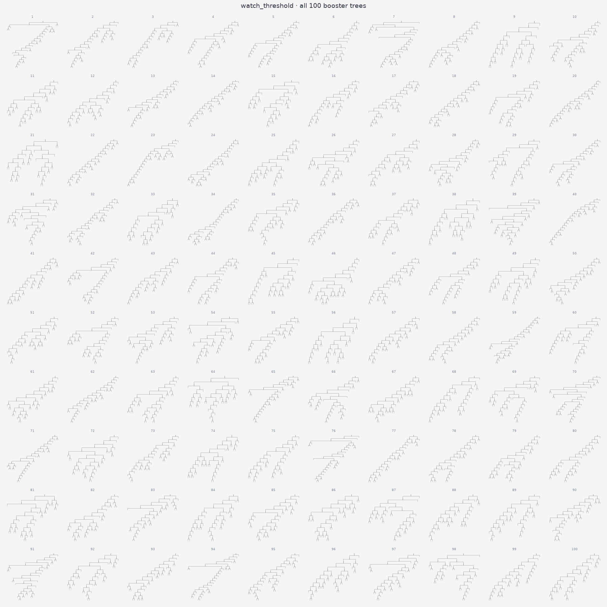

# Movie Recommendation System

A web app over a streaming catalogue of TV, movies, series and
microdrama. It answers two questions — *what is everyone watching* and
*what should this user watch next* — and attaches a one-line reason to
every item it returns.

## Install & Run

```bash
uv venv
uv pip install -e ".[dev]"
uv run uvicorn recsys.api:app --port 8000
```

Open <http://localhost:8000>.

Generated explanations additionally need a key:

```bash
cp .env.example .env   # then set DEEPSEEK_API_KEY
```

Without one, everything still works — each recommendation falls back to
the reason the algorithm itself produced.

## System Overview

Three layers, each replaceable without touching the others:

```
data.py          CSV -> typed records, bad rows quarantined
algorithms/      Recommender ABC + registry, one file per algorithm
api.py           HTTP surface, algorithm chosen by RECSYS_ALGO
explain.py       optional LLM phrasing over the algorithm's own evidence
```

`data.py` knows about files and types and nothing about recommendation.
Every modelling decision — how an event becomes a score, what counts as
heavily watched — lives under `algorithms/`. The API never imports a
concrete algorithm; it asks the registry for one by name.

### Data

Three CSV files, small enough to hold in memory and reloaded on start.

| file | rows | columns |
|---|---|---|
| `data/users.csv` | 220 | `user_id, name, age, gender, region` |
| `data/items.csv` | 260 | `item_id, title, content_type, genre` |
| `data/events.csv` | 5,000 | `user_id, item_id, event_type, watch_seconds, timestamp` |

Events span 60 days. `content_type` is series (115), movie (91),
microdrama (35) or tv (19); `genre` spans eight values led by romance
(66) and thriller (38). Every user has 12–39 events and every item 10–31,
giving a user-item matrix that is 8.4% dense.

Rows that cannot be coerced, or that reference an unknown user or item,
are dropped and counted in a `LoadReport` rather than raising. A missing
file is fatal.

**How watch history becomes a signal.** The interaction score is a
function of `event_type` alone:

```
complete 3.0 · like 2.5 · save 2.0 · play 1.0 · pause 0.0 · skip -1.0
```

`watch_seconds` is deliberately excluded. In this dataset it is a
function of the event type rather than of engagement — within
play/like/complete it is indistinguishable from Uniform(120, 3600)
(KS p = 0.39/0.11/0.005) and correlates −0.009 with an item's interaction
count. Weighting by it would weight noise. It is used only to decide
whether an item counts as "heavily watched" and should be withheld
(`RECSYS_HEAVY_WATCH_SECONDS`, default 1800, or any `complete` event).

### Global Recommendation System

`recommend_popular(k)` returns the same ranked list for every caller,
served by `GET /popular`.

Popularity is the sum of the event weights above across all users, so an
item finishing a session outranks one that was opened and skipped. If `k`
exceeds the catalogue, every item is returned. The list is deterministic:
the same dataset always produces the same order.

This is also the fallback path. An unknown user, or a known user with no
history, gets this list with `"fallback_used": true`.

### Personal Recommendation System

`recommend_for_user(user_id, k)` ranks the catalogue for one user, served
by `GET /recommendations`. Items the user has already heavily watched are
withheld.

The default is **`item_knn`** — item-based k-nearest-neighbours over the
interaction matrix. Items are described by who watched them, similarity
is the cosine between those columns, neighbours are truncated to the top
50, and a candidate scores the sum of its similarities to everything the
user engaged with.

Two properties decide this default, and predictive accuracy is not one of
them:

- **Coverage** — it surfaces ~95% of the catalogue and gives 220 of 220
  users a different list, where popularity surfaces ~5% and gives
  everyone the same one.
- **Explainability** — the score is a sum over the user's watched items,
  so the largest term names the title responsible: *"Because you watched
  Reply 1988 S3E8."* That term is computed while ranking, not
  reconstructed afterwards.

**On accuracy.** Nine algorithms were evaluated offline (5-fold CV,
n = 3,886 held-out interactions, HR@10 and NDCG@10, paired bootstrap
against a random baseline). **None separates from random** — every 95%
confidence interval straddles zero. Corroborating diagnostics: per-user
genre concentration matches shuffled data (HHI 0.1847 vs 0.1848),
demographic association χ²/dof is 0.98–1.20, and a user's own history
predicts their next genre *worse* than the global mode (0.180 vs 0.244).

This is a property of the provided `events.csv`, whose interactions are
consistent with uniform random sampling of (user, item) pairs. The
analysis is in `docs/recommender-research.md`; the scripts that produce
it are in `research/`.

### Project Structure

```
src/recsys/
  data.py                    CSV -> User/Item/Event records + LoadReport
  api.py                     FastAPI app; resolves RECSYS_ALGO once at startup
  explain.py                 DeepSeek call; degrades to native reasons
  web/index.html             single-file frontend, no build step
  algorithms/
    base.py                  Recommender ABC, Rec dataclass, REGISTRY, build()
    signals.py               event weights, affinity matrix, heavily-watched
    popularity.py            global ranking; the fallback for every algorithm
    item_knn.py              default; cosine item-item neighbourhoods
    watch_threshold.py       gradient-boosted P(watch_seconds > K)

tests/
  test_algorithms.py         shared contract, parametrized over REGISTRY
  test_base.py               registry and Rec construction
  test_data.py               loading, coercion, quarantine
  test_signals.py            weighting and heavily-watched rules
  test_item_knn.py           algorithm-specific behaviour
  test_watch_threshold.py    algorithm-specific behaviour
  test_api.py                routes, k handling, fallback contract
  test_explain.py            LLM degradation paths

data/                        users.csv, items.csv, events.csv
research/                    evaluation and diagnostic scripts (see below)
decision-visualized/         100 booster-tree PNGs + contact sheet
docs/                        research write-up, model anatomy, spec, plan
pyproject.toml               deps, pytest and ruff configuration
```

Adding an algorithm means adding one file under `algorithms/` and one
import line. Nothing in `api.py`, `data.py` or the contract suite
changes — the registry is the only coupling point.

The scripts in `research/` are the evidence behind the accuracy claims
above, and each runs standalone:

| script | what it measures |
|---|---|
| `benchmark_algorithms.py` | 19 configurations, temporal leave-last-out |
| `kfold_eval.py` | 5-fold CV with paired bootstrap against random |
| `significance_test.py` | repeated splits, confidence intervals |
| `sequential_signal.py` | session structure and genre transitions |
| `watchsec_regression.py` | predicting `watch_seconds` from side features |
| `binary_threshold_clf.py` | `watch_seconds > K` swept across ten thresholds |
| `event_type_clf.py` | predicting `event_type` from side features |
| `render_trees.py` | regenerates `decision-visualized/` from the model |

## API Docs

| Method | Path | Example |
|---|---|---|
| GET | `/health` | `curl localhost:8000/health` |
| GET | `/users` | `curl localhost:8000/users` |
| GET | `/popular?k=` | `curl 'localhost:8000/popular?k=5'` |
| GET | `/recommendations?user_id=&k=` | `curl 'localhost:8000/recommendations?user_id=u1&k=5'` |
| POST | `/explain` | `curl -X POST localhost:8000/explain -H 'Content-Type: application/json' -d '{"user_id":"u1","item_ids":["i118"]}'` |

An unknown `user_id` returns 200 with `"fallback_used": true` and the
globally popular list.

### Swapping the Algorithm

```bash
RECSYS_ALGO=popularity uv run uvicorn recsys.api:app --port 8000
```

Shipped: `popularity`, `item_knn` (default), `watch_threshold`.

To add one, create `src/recsys/algorithms/<name>.py`:

```python
from recsys.algorithms.base import Recommender, register

@register
class MyRecommender(Recommender):
    name = "mine"

    def recommend_popular(self, k=10): ...
    def recommend_for_user(self, user_id, k=10): ...
```

Import it in `src/recsys/algorithms/__init__.py` and set
`RECSYS_ALGO=mine`. The contract suite in `tests/test_algorithms.py` is
parametrized over the registry, so it picks the new algorithm up
automatically — no test file changes.

### Explanations

Two layers over one evidence object:

1. **The algorithm's own reason**, computed while ranking and returned by
   `/recommendations`. Always present, no network required.
2. **The LLM's phrasing of that same evidence**, from `POST /explain`.

The model is given the chosen items and their evidence and asked only for
wording. It never selects, scores or reorders — anything it returns for
an item that was not recommended is discarded. If the call fails, times
out, returns malformed JSON, or omits an item, that item keeps its native
reason and the response reports `"degraded": true`.

### Decision tree visualizations

`watch_threshold` ranks items by the predicted probability that a user
watches past `RECSYS_WATCH_THRESHOLD_SECONDS` (default 600), from a
gradient-boosted tree over `(age, gender, region, content_type, genre,
title unigrams)`. It is a plug-in alongside the other algorithms:

```bash
RECSYS_ALGO=watch_threshold uv run uvicorn recsys.api:app --port 8000
```

A prediction is a sum over **100 boosted trees**, each 31 leaves wide and
up to 20 levels deep — 3,000 splits in total. Every one is rendered:

[](decision-visualized/all-trees-contact-sheet.png)

| | |
|---|---|
| `decision-visualized/tree-001.png` … `tree-100.png` | one tree each, labelled to depth 3 |
| `decision-visualized/all-trees-contact-sheet.png` | all 100 shapes at a glance |
| `docs/decision-tree.html` | prediction pipeline, a traced decision path, and tree 1 in full |

Regenerate with:

```bash
uv run python research/render_trees.py
```

Two things the shapes show. **`age` takes 27.3% of all 3,000 splits** —
it is the only continuous feature, so a tree can re-cut it at many
thresholds while every other feature is binary and splits once. And the
trees run **20 levels deep to reach 31 leaves**: a few wide splits near
the root, then long thin chains peeling off small groups of rows. The
root split of tree 1 is `title~cemara`, isolating 70 of 5,000 rows on a
single title word.

That shape is what fitting noise looks like, and it agrees with the
measurement — held-out AUC at K=600 is 0.515, against 0.522 for
deliberately shuffled labels, with accuracy never beating the
majority-class rate. Sweeping the threshold from 30 to 3000 seconds does
not change it (`research/binary_threshold_clf.py`), and the same features
predict `event_type` no better (`research/event_type_clf.py`). The
structure is real; the rule it encodes does not generalise.

### Tests

```bash
uv run pytest
```

92 tests, offline, no API key needed. `tests/test_algorithms.py` is the
shared contract every registered algorithm must satisfy; the rest cover
loading, signals, the API surface and the explanation layer.

### Design documents

- `docs/superpowers/specs/2026-09-09-recommender-system-design.md` — design spec
- `docs/superpowers/plans/2026-09-09-recommender-system.md` — implementation plan
- `docs/recommender-research.md` — dataset analysis and algorithm survey
- `docs/decision-tree.html` — `watch_threshold` model anatomy
